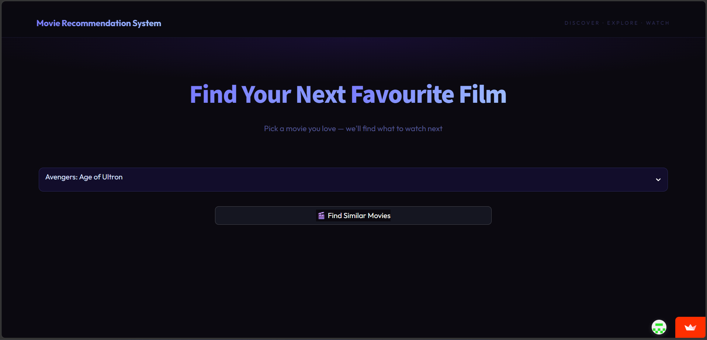
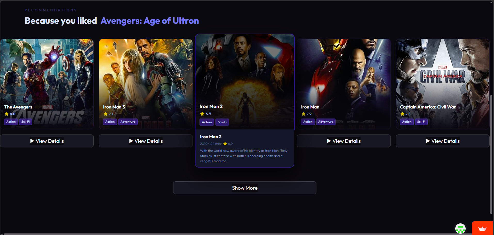

# 🎬 Movie Recommendation System 
🌐 **Deployed on Streamlit Cloud:**

[](https://movie-recommendation-system-by-kalpesh-nankar.streamlit.app/)

> **👉 [https://movie-recommendation-system-by-kalpesh-nankar.streamlit.app/](https://movie-recommendation-system-by-kalpesh-nankar.streamlit.app/)**

---

A **content-based movie recommendation web app** built from scratch using Python and Streamlit. You select any movie from a dataset of **4,800+ films**, and the system instantly finds and displays the most similar movies — complete with live posters, ratings, genres, runtime, and plot details fetched in real time from the OMDB API.

The recommendation engine was trained in a Google Colab notebook using **NLP text preprocessing** (tokenization, stemming), **Bag-of-Words vectorization** (CountVectorizer with 5,000 features), and **Cosine Similarity** to measure how closely any two movies match based on their combined overview, genres, keywords, cast, and director.

The notebook also explores and compares additional ML techniques — **SVM**, **Naive Bayes**, **KMeans clustering**, **Hierarchical clustering**, **PCA visualization**, and **Apriori association rules** — to provide a full data mining study alongside the core recommender.

The frontend is a custom-styled, fully responsive Streamlit app with a **premium dark theme** inspired by Netflix and IMDb, supporting desktop (5 cards/row), tablet (3 cards/row), and mobile (2 cards/row) layouts with hover popups, animated cards, and progressive "Show More" loading.

---

## 📌 Table of Contents

- [Overview](#overview)
- [Live Demo](#live-demo)
- [Features](#features)
- [Project Structure](#project-structure)
- [Dataset](#dataset)
- [How It Works](#how-it-works)
- [ML Techniques Used](#ml-techniques-used)
- [Tech Stack](#tech-stack)
- [Installation & Setup](#installation--setup)
- [Running the App](#running-the-app)
- [Screenshots](#screenshots)
- [Research References](#research-references)
- [Authors](#authors)

---

## 📖 Overview

The **Movie Recommendation System** is a full-stack data mining project that recommends movies similar to a user-selected title. It combines **Natural Language Processing (NLP)**, **Content-Based Filtering** using **Cosine Similarity**, and supplementary classification algorithms (SVM, Naive Bayes) and clustering (KMeans, Hierarchical) explored during the research phase.

The final model is deployed as a responsive, Netflix-style **Streamlit web application** that fetches live movie data (posters, ratings, plot, runtime) from the **OMDB API**.

---

## 🚀 Live Demo

🌐 **Deployed on Streamlit Cloud:**

[](https://movie-recommendation-system-by-kalpesh-nankar.streamlit.app/)

> **👉 [https://movie-recommendation-system-by-kalpesh-nankar.streamlit.app/](https://movie-recommendation-system-by-kalpesh-nankar.streamlit.app/)**

**Or run locally:**
```bash
streamlit run app2.py
```
Local access at: `http://localhost:8502`

---

## ✨ Features

- 🔍 **Content-Based Recommendations** — Suggests movies based on plot, genres, cast, crew, and keywords
- 🎭 **Movie Detail Page** — Full view with poster, rating, runtime, genres, cast, and plot
- 🖼️ **Live Poster Fetching** — Posters loaded in parallel via OMDB API
- 📱 **Fully Responsive UI** — Works on desktop (5 cards/row), tablet (3 cards/row), and mobile (2 cards/row)
- 🌙 **Premium Dark Theme** — Netflix / IMDb inspired design using the Outfit font
- 🔎 **Hover Popups** — Quick-preview card showing plot, year, runtime on hover (desktop)
- ➕ **Load More** — Progressive disclosure showing 5 recommendations at a time up to 30
- ⚡ **Parallel API Fetching** — `ThreadPoolExecutor` for fast multi-poster loading
- 🎯 **Smart Fallback** — If fewer than 30 similar movies exist, pads with popular titles

---

## 📁 Project Structure

```
Movie-Recommendation-System/
│
├── app2.py                        # Main Streamlit web application
├── Final_Recommender_System.ipynb # Full ML pipeline notebook (Google Colab)
│
├── movies.pkl                     # Preprocessed movies DataFrame (pickle)
├── similarity.pkl                 # Cosine similarity matrix (pickle)
│
├── requirements.txt               # Python dependencies
└── README.md                      # This file
```

---

## 📊 Dataset

| Property | Details |
|---|---|
| **Source** | [TMDB 5000 Movie Dataset](https://www.kaggle.com/datasets/tmdb/tmdb-movie-metadata) |
| **Files** | `tmdb_5000_movies.csv` + `tmdb_5000_credits.csv` |
| **Total Movies** | 4,806 after merge and cleaning |
| **Movies CSV columns** | `budget`, `genres`, `id`, `keywords`, `overview`, `popularity`, `release_date`, `revenue`, `runtime`, `title`, `vote_average`, `vote_count`, and more (20 columns total) |
| **Credits CSV columns** | `movie_id`, `title`, `cast`, `crew` |
| **Hosted** | Google Drive (loaded via URL in notebook) |

---

## ⚙️ How It Works

### Step 1 — Data Loading & Merging
Both CSV files are loaded from Google Drive and merged on the `title` column, resulting in a unified DataFrame of 4,806 movies with 24 columns.

### Step 2 — Feature Extraction
The following fields are extracted and combined into a single `tags` column per movie:

```
tags = overview + genres + keywords + cast (top 3) + director
```

### Step 3 — Text Preprocessing (NLP Pipeline)
1. **Lowercasing** — all tags converted to lowercase
2. **Stemming** — Porter Stemmer reduces words to root form  
   *(e.g. "actions" → "action", "running" → "run")*
3. **Stop word removal** — handled inside CountVectorizer

### Step 4 — Vectorization
```python
from sklearn.feature_extraction.text import CountVectorizer

cv = CountVectorizer(max_features=5000, stop_words='english')
vector = cv.fit_transform(new_movies['tags']).toarray()
# Shape: (4806, 5000)
```

### Step 5 — Cosine Similarity
```python
from sklearn.metrics.pairwise import cosine_similarity

similarity = cosine_similarity(vector)
# Shape: (4806, 4806) — pairwise similarity scores for all movies
```

### Step 6 — Recommendation Function
```python
def recommend(movie, num=30):
    idx = movies[movies["title"] == movie].index[0]
    top = sorted(enumerate(similarity[idx]), reverse=True,
                 key=lambda x: x[1])[1:num+1]
    return [movies.iloc[i].title for i, _ in top]
```

### Step 7 — Export Model
```python
import pickle
pickle.dump(movies, open('movies.pkl', 'wb'))
pickle.dump(similarity, open('similarity.pkl', 'wb'))
```

---

## 🧠 ML Techniques Used

The notebook explores and compares several machine learning approaches:

### ✅ Core (Used in Production)
| Technique | Purpose | Library |
|---|---|---|
| **CountVectorizer** | Text → numeric vectors (Bag of Words) | `sklearn` |
| **Porter Stemmer** | NLP — word normalization | `nltk` |
| **Cosine Similarity** | Finding similar movies | `sklearn.metrics.pairwise` |

### 🔬 Explored (Research & Comparison)
| Technique | Purpose | Notes |
|---|---|---|
| **SVM (Support Vector Machine)** | Movie rating classification (≥7 = good) | `sklearn.svm.SVC` |
| **Naive Bayes (GaussianNB)** | Alternative classifier | `sklearn.naive_bayes` |
| **KMeans Clustering** | Grouping 4,800 movies into 5 clusters | `sklearn.cluster.KMeans` |
| **Hierarchical Clustering** | Dendrogram-based clustering on 100 movies | `scipy.cluster.hierarchy` |
| **PCA (2D Visualization)** | Cluster visualization | `sklearn.decomposition.PCA` |
| **Apriori / Association Rules** | Genre co-occurrence rules (e.g. Mystery → Thriller) | `mlxtend` |
| **Train/Test Split** | 80/20 split — 3,844 train / 962 test | `sklearn.model_selection` |

### Classification Labels
```python
movies['label'] = movies['vote_average'].apply(lambda x: 1 if x >= 7 else 0)
# 1 = Good movie (vote_average ≥ 7)
# 0 = Average movie (vote_average < 7)
```

---

## 🛠️ Tech Stack

| Layer | Technology |
|---|---|
| **ML & Data** | Python, Pandas, NumPy, Scikit-learn, NLTK |
| **Visualization** | Matplotlib, Seaborn |
| **Web App** | Streamlit |
| **Styling** | Custom CSS (dark theme, responsive grid) |
| **Movie Data API** | OMDB API (posters, ratings, plot, runtime) |
| **Parallelism** | `concurrent.futures.ThreadPoolExecutor` |
| **Model Storage** | Pickle (`.pkl` files) |
| **Notebook** | Google Colab |
| **Font** | Outfit (Google Fonts) |

---

## 📦 Installation & Setup

### Prerequisites
- Python 3.8+
- pip

### 1. Clone the Repository
```bash
git clone https://github.com/your-username/movie-recommendation-system.git
cd movie-recommendation-system
```

### 2. Install Dependencies
```bash
pip install -r requirements.txt
```

**requirements.txt:**
```
streamlit
pandas
numpy
scikit-learn
nltk
requests
pickle5
```

### 3. Generate Model Files (if not present)

Run the notebook `Final_Recommender_System.ipynb` in Google Colab to generate:
- `movies.pkl`
- `similarity.pkl`

Then download both files and place them in the project root directory.

### 4. Get OMDB API Key
1. Go to [https://www.omdbapi.com/apikey.aspx](https://www.omdbapi.com/apikey.aspx)
2. Register for a free API key
3. In `app2.py`, replace the API key value:
```python
OMDB_KEY = "your_api_key_here"
```

---

## ▶️ Running the App

```bash
streamlit run app2.py
```

The app will open at `http://localhost:8502` in your browser.

---

## 📱 Responsive Layout

| Device | Cards Per Row | Breakpoint |
|---|---|---|
| Large Desktop | 5 | > 1200px |
| Desktop | 5 | > 992px |
| Tablet Landscape | 5 | ≤ 992px |
| Tablet Portrait | 3 | ≤ 768px |
| Mobile | 2 | ≤ 576px |
| Small Phone | 2 | ≤ 400px |

---

## 🖼️ Screenshots

### 🏠 Home Page — Search & Select
> Clean hero section with movie dropdown and "Find Similar Movies" button



---

### 🎬 Recommendations Page — Movie Cards
> "Because you liked..." section with live posters, ratings, genre tags, hover popup, and View Details buttons



---

## 📚 Research References

**Research Paper 1**
- **Title:** Movie Recommendation and Sentiment Analysis Using Machine Learning
- **Methods:** Cosine Similarity + SVM + Naive Bayes
- **Source:** ScienceDirect, Procedia Computer Science, 2022
- **Link:** https://www.sciencedirect.com/science/article/pii/S2666285X22000176

**Research Paper 2**
- **Title:** Improving Movie Recommendation Systems Filtering by Exploiting User-Based Reviews
- **Methods:** KMeans Clustering + Hierarchical + Naive Bayes
- **Source:** PMC (PubMed Central), 2020
- **Link:** https://pmc.ncbi.nlm.nih.gov/articles/PMC7256369/

---

## 👨‍💻 Authors

Developed as part of **Data Mining (3160714)** — CIPAT Mini Project

---

## 📄 License

This project is for educational purposes under the CIPAT academic program.

---

<div align="center">
  <strong>⭐ If you found this helpful, give it a star!</strong>
</div>
