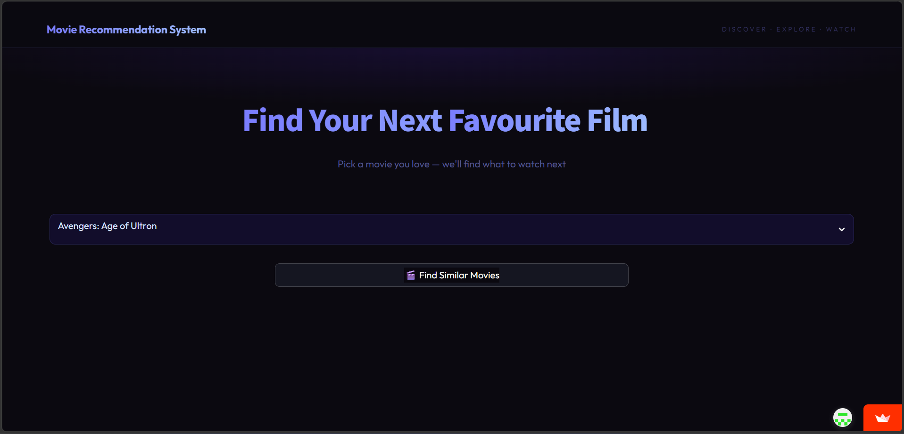
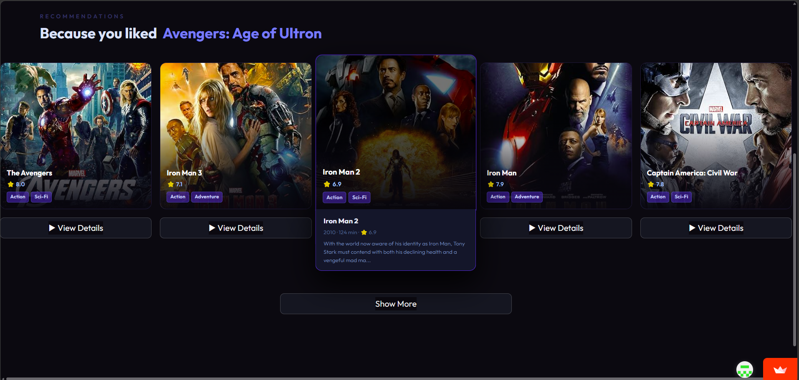

<div align="center">

# 🎬 Movie Recommendation System

### Content-Based Movie Recommendations using NLP, Cosine Similarity & Streamlit

A machine-learning-powered web application that recommends similar movies based on **plot, genres, keywords, cast, and director**, with real-time movie information and a responsive streaming-platform-inspired interface.

[**🚀 Live Demo**](https://movie-recommendation-system-by-kalpesh-nankar.streamlit.app/) • [**📂 Source Code**](https://github.com/nankarkalpesh/movie-recommendation-system)


</div>

---

## Overview

The **Movie Recommendation System** is an end-to-end machine learning web application that recommends movies similar to a title selected by the user.

The recommendation engine is built using **Natural Language Processing (NLP)** and **content-based filtering**. Movie metadata—including overview, genres, keywords, cast, and director—is transformed into numerical feature vectors using **Bag-of-Words**, and **Cosine Similarity** is used to identify the most similar movies.

The system works with a processed dataset of **4,806 movies** from the TMDB 5000 Movie Dataset. The trained artifacts are integrated into a responsive **Streamlit application**, while movie posters, ratings, runtime, genres, cast, and descriptions are enriched using external movie-data sources.

### What this project demonstrates

- NLP-based feature engineering
- Content-based recommendation systems
- Vectorization using CountVectorizer
- Similarity measurement using Cosine Similarity
- Data preprocessing with Pandas
- Model serialization using Pickle
- REST API integration
- Concurrent API requests for improved performance
- Responsive Streamlit application development
- Machine learning model deployment

---

## Live Application

### [Launch Movie Recommendation System →](https://movie-recommendation-system-by-kalpesh-nankar.streamlit.app/)

Select a movie and the application generates up to **30 related recommendations**, including posters and additional movie information.

---

## Application Preview

### Home Page

<p align="center">
  
</p>

The home interface allows users to select a movie and generate similar recommendations.

### Recommendation Results

<p align="center">
  
</p>

Recommendations are presented as responsive movie cards containing ratings, genres, posters, and additional movie information.

---

## Key Features

| Feature | Description |
|---|---|
| **Content-Based Recommendations** | Recommends movies using similarity between plot, genres, keywords, cast, and director |
| **NLP Processing** | Cleans and transforms textual movie metadata into machine-readable features |
| **Cosine Similarity** | Measures similarity between movies in the vector space |
| **Movie Details** | Displays poster, IMDb rating, genres, runtime, cast, director, and plot |
| **Real-Time Data Enrichment** | Retrieves additional movie information using external APIs |
| **Responsive Interface** | Optimized layouts for desktop, tablet, and mobile devices |
| **Parallel API Requests** | Uses `ThreadPoolExecutor` to retrieve information for multiple movies concurrently |
| **Progressive Results** | Displays recommendations incrementally through a “Show More” experience |
| **Caching** | Uses Streamlit caching to reduce repeated data loading and API work |
| **Fallback Handling** | Handles unavailable posters, metadata, and incomplete recommendation results |

---

## How the Recommendation System Works

```text
TMDB Movie Dataset
        │
        ▼
Data Cleaning & Merging
        │
        ▼
Feature Extraction
        │
        ├── Overview
        ├── Genres
        ├── Keywords
        ├── Top Cast
        └── Director
        │
        ▼
Combined "tags" Feature
        │
        ▼
Text Preprocessing
        │
        ├── Lowercasing
        ├── Stemming
        └── Stop-word Removal
        │
        ▼
CountVectorizer
(5,000 Features)
        │
        ▼
Cosine Similarity Matrix
        │
        ▼
Top Similar Movies
        │
        ▼
Streamlit Web Application
        │
        ▼
Movie Metadata & Posters
```

---

## Recommendation Pipeline

### 1. Data Loading

The project uses two files from the **TMDB 5000 Movie Dataset**:

```text
tmdb_5000_movies.csv
tmdb_5000_credits.csv
```

The datasets are merged to combine movie metadata with cast and crew information.

---

### 2. Feature Engineering

The most relevant attributes for recommendation are extracted:

```text
overview
genres
keywords
cast
director
```

These attributes are combined into a single textual representation:

```python
tags = overview + genres + keywords + cast + director
```

This allows every movie to be represented by its important semantic characteristics.

---

### 3. NLP Preprocessing

Text preprocessing includes:

- Converting text to lowercase
- Extracting structured information from genres, cast, keywords, and crew
- Applying Porter stemming
- Removing English stop words during vectorization

For example:

```text
actions  → action
running  → run
connected → connect
```

---

### 4. Bag-of-Words Vectorization

The combined tags are transformed into numerical vectors using Scikit-learn's `CountVectorizer`.

```python
from sklearn.feature_extraction.text import CountVectorizer

cv = CountVectorizer(
    max_features=5000,
    stop_words="english"
)

vectors = cv.fit_transform(movies["tags"]).toarray()
```

Each movie is represented in a **5,000-dimensional feature space**.

---

### 5. Cosine Similarity

Similarity between movie vectors is calculated using:

```python
from sklearn.metrics.pairwise import cosine_similarity

similarity = cosine_similarity(vectors)
```

Cosine similarity measures how closely two movie feature vectors point in the same direction.

A higher similarity score means the movies share more characteristics.

---

### 6. Recommendation Generation

When a user selects a movie:

1. The selected movie is located in the dataset.
2. Its similarity scores against every other movie are retrieved.
3. Scores are sorted in descending order.
4. The selected movie itself is excluded.
5. The most similar titles are returned.
6. Additional movie metadata is retrieved for presentation.

---

## Technology Stack

| Category | Technologies |
|---|---|
| **Programming Language** | Python |
| **Data Processing** | Pandas, NumPy |
| **Machine Learning** | Scikit-learn |
| **NLP** | CountVectorizer, Porter Stemming |
| **Recommendation Method** | Content-Based Filtering |
| **Similarity Metric** | Cosine Similarity |
| **Web Framework** | Streamlit |
| **API Integration** | OMDb API, Wikipedia |
| **Concurrency** | Python `concurrent.futures` |
| **Model Storage** | Pickle |
| **Development Environment** | Google Colab |
| **Dataset** | TMDB 5000 Movie Dataset |

---

## Dataset

This project uses the **TMDB 5000 Movie Dataset** available on Kaggle.

**Dataset:**  
https://www.kaggle.com/datasets/tmdb/tmdb-movie-metadata

| Property | Value |
|---|---|
| Movies after preprocessing | **4,806** |
| Movie metadata source | `tmdb_5000_movies.csv` |
| Cast & crew source | `tmdb_5000_credits.csv` |
| Main recommendation features | Overview, genres, keywords, cast, director |

The dataset contains additional information such as budget, popularity, release date, revenue, runtime, vote average, and vote count.

---

## Project Structure

```text
movie-recommendation-system/
│
├── Deployapp.py
│   └── Streamlit web application
│
├── Final_Recommender_System.ipynb
│   └── Data preprocessing, recommendation pipeline
│       and machine learning experiments
│
├── movies.pkl
│   └── Preprocessed movie dataset
│
├── similarity.pkl
│   └── Precomputed cosine similarity matrix
│
├── tmdb_5000_movies.csv
├── tmdb_5000_credits.csv
│   └── Original TMDB datasets
│
├── Home.png
├── recommendations.png
│   └── Application screenshots
│
├── Research_Paper1.pdf
├── Research_Paper2.pdf
│   └── Research references
│
├── requirements.txt
└── README.md
```

---

## Getting Started

### Prerequisites

Make sure you have installed:

```text
Python 3.8+
pip
Git
```

### 1. Clone the Repository

```bash
git clone https://github.com/nankarkalpesh/movie-recommendation-system.git
cd movie-recommendation-system
```

### 2. Create a Virtual Environment

#### Windows

```bash
python -m venv .venv
.venv\Scripts\activate
```

#### macOS / Linux

```bash
python3 -m venv .venv
source .venv/bin/activate
```

### 3. Install Dependencies

```bash
pip install -r requirements.txt
```

### 4. Configure the OMDb API Key

Create an API key from:

https://www.omdbapi.com/apikey.aspx

For security, store API credentials using **Streamlit Secrets** rather than committing keys directly to GitHub.

Create:

```text
.streamlit/secrets.toml
```

Add:

```toml
OMDB_API_KEY = "your_api_key_here"
```

Then access it in the Streamlit application with:

```python
OMDB_KEY = st.secrets["OMDB_API_KEY"]
```

> Never commit `secrets.toml` or API keys to a public GitHub repository.

### 5. Run the Application

```bash
streamlit run Deployapp.py
```

Streamlit will display the local application URL in your terminal, typically:

```text
http://localhost:8501
```

---

## Model Artifacts

The deployed application uses two serialized files:

```text
movies.pkl
similarity.pkl
```

`movies.pkl` contains the processed movie information required by the application.

`similarity.pkl` contains the precomputed pairwise cosine similarity matrix.

These files allow the deployed application to generate recommendations without rebuilding the complete NLP pipeline on every startup.

---

## Additional Machine Learning Experiments

Alongside the production recommendation engine, the project notebook explores additional data-mining and machine-learning techniques for academic analysis.

| Technique | Experiment |
|---|---|
| **Support Vector Machine (SVM)** | Movie rating classification |
| **Naive Bayes** | Alternative classification approach |
| **K-Means** | Movie clustering |
| **Hierarchical Clustering** | Similarity-based hierarchical groups |
| **PCA** | Two-dimensional cluster visualization |
| **Apriori Algorithm** | Genre association-rule analysis |

> These techniques are experimental analyses and are **not part of the production recommendation algorithm**. The deployed recommendation engine uses content-based filtering with CountVectorizer and Cosine Similarity.

---

## Performance Considerations

Several techniques are used to improve the application experience:

**Precomputed Similarity Matrix**  
The pairwise cosine similarity matrix is calculated during preprocessing rather than every time a user requests recommendations.

**Streamlit Caching**  
Model artifacts and repeated data operations are cached to reduce unnecessary computation.

**Parallel API Requests**  
Movie information is requested concurrently using Python's `ThreadPoolExecutor`, reducing the time required to populate multiple recommendation cards.

**Progressive Rendering**  
Recommendations are displayed incrementally instead of overwhelming the interface with all results at once.

---

## Limitations

The current system is based entirely on movie metadata, so recommendations reflect **content similarity rather than individual user preferences**.

Other limitations include:

- No user-rating or viewing-history personalization
- Recommendations are limited to movies available in the source dataset
- External metadata depends on third-party API availability
- Bag-of-Words does not fully capture semantic meaning or context
- The current similarity matrix grows quadratically with the number of movies

---

## Future Improvements

Potential extensions include:

- Hybrid recommendation using collaborative and content-based filtering
- User accounts and personalized recommendation history
- Sentence embeddings or transformer-based semantic similarity
- Approximate nearest-neighbor search for larger datasets
- Recommendation evaluation using Precision@K, Recall@K, or NDCG
- Improved search and filtering by genre, year, and rating
- Containerized deployment with Docker
- Automated tests and CI/CD integration

---

## Research References

### Movie Recommendation and Sentiment Analysis Using Machine Learning

**Methods explored:** Cosine Similarity, SVM, Naive Bayes  
**Source:** Procedia Computer Science

https://www.sciencedirect.com/science/article/pii/S2666285X22000176

### Improving Movie Recommendation Systems Filtering by Exploiting User-Based Reviews

**Methods explored:** Clustering, classification, and recommendation approaches  
**Source:** PubMed Central

https://pmc.ncbi.nlm.nih.gov/articles/PMC7256369/

---

## Academic Context

Developed as a **Data Mining Mini Project** to explore recommendation systems, natural language processing, classification, clustering, association-rule mining, and machine-learning deployment.

The production application focuses on **content-based movie recommendation**, while the accompanying notebook contains additional experiments conducted as part of the broader data-mining study.

---

## Author

**Kalpesh Nankar**

GitHub: [@nankarkalpesh](https://github.com/nankarkalpesh)

---

<div align="center">

### ⭐ If you find this project useful, consider giving the repository a star.

**Built with Python, Scikit-learn and Streamlit**

</div>
